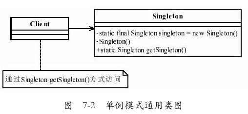
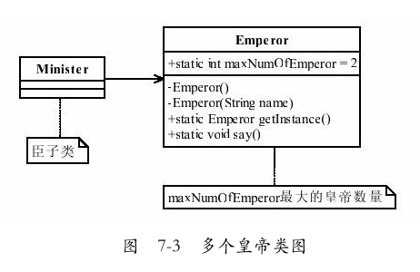

# 单例模式

### 一、单例模式的定义
- `Ensure a class has only one instance,and provide a global point of accessto it`.
- 确保某一个类只有一个实例，而且自行实例化并向整个系统提供这个实例。
- 单例模式确保某个类只有一个实例，而且自行实例化并向整个系统提供这个实例。
  - 在计算机系统中，线程池、缓存、日志对象、对话框、打印机、显卡的驱动程序对象常被设计成单例。这些应用都或多或少具有资源管理器的功能。
  - 每台计算机可以有若干个打印机，但只能有一个Printer Spooler，以避免两个打印作业同时输出到打印机中。
  - 每台计算机可以有若干通信端口，系统应当集中管理这些通信端口，以避免一个通信端口同时被两个请求同时调用。
  - 总之，选择单例模式就是为了避免不一致状态，避免政出多头。

	

### 二、单例模式的一个比较通用的代码（饿汉式单例）
```java
public class Singleton{
    private static final Singleton singleton = new Singleton();
	//限制产生多个对象
    private Singleton(){
        
    }
    //通过该方法获得实例对象
    public static Singleton getSingleton(){
        return singleton;
    }
    //类中其他方法，尽量是static
    public static void doSomething(){
        
    }
}
```

### 三、单例模式的优点
**系统内存中该类只存在一个对象，节省了系统资源，对于一些需要频繁创建销毁的对象，使用单例模式可以提高系统性能**。

- 由于单例模式在内存中只有一个实例，**减少了内存开支**，特别是一个对象需要频繁地创建、销毁时，而且创建或销毁时性能又无法优化，单例模式的优势就非常明显。
- 由于单例模式只生成一个实例，所以**减少了系统的性能开销**，当一个对象的产生需要比较多的资源时，如读取配置、产生其他依赖对象时，则可以通过在应用启动时直接产生一个单例对象，然后用永久驻留内存的方式来解决（在Java EE中采用单例模式时需要注意JVM垃圾回收机制）。
- 单例模式**可以避免对资源的多重占用**，例如一个写文件动作，由于只有一个实例存在内存中，避免对同一个资源文件的同时写操作。
- 单例模式可以**在系统设置全局的访问点，优化和共享资源访问**，例如可以设计一个单例类，负责所有数据表的映射处理。

### 四、单例模式的缺点
当想实例化一个单例类的时候，必须要记住使用相应的获取对象的方法，而不是使用new，可能会给其他开发人员造成困扰，特别是看不到源码的时候。
- 单例模式一般没有接口，**扩展很困难，若要扩展，除了修改代码基本上没有第二种途径可以实现**。单例模式为什么不能增加接口呢？因为接口对单例模式是没有任何意义的，它要求“自行实例化”，并且提供单一实例、接口或抽象类是不可能被实例化的。当然，在特殊情况下，单例模式可以实现接口、被继承等，需要在系统开发中根据环境判断。
- 单例模式**对测试是不利的**。在并行开发环境中，如果单例模式没有完成，是不能进行测试的，没有接口也不能使用mock的方式虚拟一个对象。
- **单例模式与单一职责原则有冲突**。一个类应该只实现一个逻辑，而不关心它是否是单例的，是不是要单例取决于环境，单例模式把“要单例”和业务逻辑融合在一个类中。

### 五、单例模式特点：
- 1、单例类只能有一个实例。
- 2、单例类必须自己创建自己的唯一实例。
- 3、单例类必须给所有其他对象提供这一实例。

### 六、线程安全的问题
- 一方面在获取单例的时候，要保证不能产生多个实例对象；
- 另一方面，在使用单例对象的时候，要注意单例对象内的实例变量是会被多线程共享的，推荐使用无状态的对象，不会因为多个线程的交替调度而破坏自身状态导致线程安全问题，比如我们常用的VO（View Object：视图对象），DTO（Data Transfer Object：数据传输对象）等。
	- 局部变量是在用户栈中的，而且用户栈本身就是线程私有的内存区域，所以不存在线程安全问题。

### 七、单例模式的使用场景

- 在一个系统中，要求一个类有且仅有一个对象，如果出现多个对象就会出现“不良反应”，可以采用单例模式，具体的场景如下：
  - 要求生成唯一序列号的环境；
  - 在整个项目中需要一个共享访问点或共享数据，例如一个Web页面上的计数器，可以不用把每次刷新都记录到数据库中，使用单例模式保持计数器的值，并确保是线程安全的；
  - 创建一个对象需要消耗的资源过多，如要访问IO和数据库等资源；
  - 需要定义大量的静态常量和静态方法（如工具类）的环境，可以采用单例模式（当然，也可以直接声明为static的方式）。

### 八、JDK中的那些单例模式
- 确保只实例化一个对象，并提供一个对象的全局访问点。
- 1、java.lang.Runtime
  ```java
  java.lang.Runtime#getRuntime()
  
  /**
   * @see     java.lang.Runtime#getRuntime()
   * @since   JDK1.0
   */
  public class Runtime {
      private static Runtime currentRuntime = new Runtime();
      public static Runtime getRuntime() {
          return currentRuntime;
      }
      private Runtime() {}
  }
  ```
- 2、GUI中的单例
  ```java
  java.awt.Toolkit#getDefaultToolkit()
  java.awt.GraphicsEnvironment#getLocalGraphicsEnvironment()
  java.awt.Desktop#getDesktop()
  ```
- 3、Spring依赖注入Bean实例默认是单例的。
  - Spring单例Bean与单例模式的区别在于它们关联的环境不一样，单例模式是指在一个JVM进程中仅有一个实例，而Spring单例是指一个Spring Bean容器(ApplicationContext)中仅有一个实例。
  - Spring的单例Bean是与其容器（ApplicationContext）密切相关的，所以在一个JVM进程中，如果有多个Spring容器，即使是单例bean，也一定会创建多个实例。
  - Spring的单例bean与Spring bean管理容器密切相关，每个容器都会创建自己独有的实例，所以与GOF（`gang of four` 的简写,四人帮的意思）设计模式中的单例模式相差极大，但在实际应用中，如果将对象的生命周期完全交给Spring管理(不在其他地方通过new、反射等方式创建)，其实也能达到单例模式的效果。


### 九、单例模式的注意事项
- 首先，在高并发情况下，请注意**单例模式的线程同步问题**。单例模式有几种不同的实现方式，上面的例子（饿汉式单例）不会出现产生多个实例的情况。
  - 解决线程不安全的方法很有多，可以在getSingleton方法前加synchronized关键字，也可以在getSingleton方法内增加synchronized来实现，但都不是最优秀的单例模式，**建议使用饿汉式单例**。
- 其次，需要考虑**对象的复制情况**。在Java中，对象默认是不可以被复制的，若实现了Cloneable接口，并实现了clone方法，则可以直接通过对象复制方式创建一个新对象，对象复制是不用调用类的构造函数，因此即使是私有的构造函数，对象仍然可以被复制。在一般情况下，类复制的情况不需要考虑，很少会出现一个单例类会主动要求被复制的情况，
	- 解决该问题的最好方法就是单例类不要实现Cloneable接口。

### 十、单例模式的各种实现
- 饿汉式单例
  - [饿汉式单例（静态常量）——线程安全的【可用】](#1饿汉式单例静态常量)
  - [饿汉式单例（静态代码块）——线程安全【可用】](#2饿汉式单例静态代码块)
- 懒汉式单例
  - [懒汉式单例（只适用于单线程）——线程不安全【不可用】](#3懒汉式单例只适用于单线程)
  - [懒汉式单例（同步方法）——线程安全（虽然在多线程环境中能工作但效率不高）【不推荐用】](#4懒汉式单例同步方法)
  - [懒汉式单例（同步代码块）——线程安全【不推荐用】](#5懒汉式单例同步代码块)
  - [懒汉式单例（DCL双重检查）——线程安全【推荐用】](#6懒汉式单例DCL双重检查)
  - [懒汉式单例（静态内部类）——线程安全【强烈推荐解法】](#7懒汉式单例静态内部类)
- [序列化与反序列化实现单例模式](#8序列化与反序列化实现单例模式)
- [枚举实现单例模式【推荐用】](#9枚举实现单例模式)

#### 1.饿汉式单例（静态常量）
- 饿汉式单例（静态常量）——线程安全的【可用】
- 优点：这种写法比较简单，就是在类装载的时候就完成实例化。**避免了线程同步问题**。（**线程安全的**）
- 缺点：在类装载的时候就完成实例化，没有达到Lazy Loading(延迟加载)的效果。如果从始至终从未使用过这个实例，则会造成**内存的浪费**。
  ```java
  package com.edu.singletonPattern;
  
  /**
   * @Author: sunnyandgood
   * @Date: 2019/4/21 20:22
   * 懒汉式单例
   */
  public class HungryManSingleton {
      private static final HungryManSingleton INSTANCE = new HungryManSingleton();
      private HungryManSingleton(){
  
      }
      public static HungryManSingleton getSingleton(){
          return INSTANCE;
      }
  }
  ```

#### 2.饿汉式单例（静态代码块）
- 饿汉式单例（静态代码块）——线程安全【可用】
- 这种方式和饿汉式单例——静态常量其实类似，只不过将类实例化的过程放在了静态代码块中，也是在类装载的时候，就执行静态代码块中的代码，初始化类的实例。优缺点和饿汉式单例——静态常量是一样的。
- 优点：这种写法比较简单，就是在类装载的时候就完成实例化。**避免了线程同步问题**。（**线程安全的**）
- 缺点：在类装载的时候就完成实例化，没有达到Lazy Loading(延迟加载)的效果。如果从始至终从未使用过这个实例，则会造成**内存的浪费**。
  ```java
  package com.edu.singletonPattern;
  
  /**
  * @Author: sunnyandgood
  * @Date: 2019/4/21 20:48
  */
  public class StaticCodeBlockSingleton {
      private static StaticCodeBlockSingleton singleton;
      private StaticCodeBlockSingleton(){
      
      }
      static {
          singleton = new StaticCodeBlockSingleton();
      }
      public static StaticCodeBlockSingleton getSingleton(){
          return singleton;
      }
  }
  ```


#### 3.懒汉式单例（只适用于单线程）
- 懒汉式单例（只适用于单线程）——线程不安全【不可用】
- 实现思路：由于只能生成一个实例，因此必须把构造函数设为私有函数以禁止他人创建实例。可以定义一个静态的实例，在需要的时候创建该实例。
  ```java
  package com.edu.singletonPattern;
  
  /**
   * @Author: sunnyandgood
   * @Date: 2019/4/21 20:37
   */
  public class LazyManSingleton {
      private static LazyManSingleton singleton;
      private LazyManSingleton(){
  
      }
      public static LazyManSingleton getSingleton(){
          //延迟加载
          if (singleton==null){
              singleton = new LazyManSingleton();
          }else {
  
          }
          return singleton;
      }
  }
  ```

#### 4.懒汉式单例（同步方法）
- 懒汉式单例（同步方法）——线程安全（虽然在多线程环境中能工作但效率不高）【不推荐用】
- 背景：上一个解法（懒汉式单例（只适用于单线程））中的代码在单线程的时候工作正常，但在多线程的情况下就有问题了。
  - 设想如果两个线程同时运行到判断singleton是否为null的if语句，并且instance的确没有创建时，那么两个线程都会创建一个实例，此时`LazySingleton`就不再满足单例模式的要求了。
  - 为了保证在多线程环境下还能得到类型的一个实例，需要加上一个同步锁。把`LazyManSingleton`稍做修改得到如下代码：
  ```java
  package com.edu.singletonPattern;
  
  /**
   * @Author: sunnyandgood
   * @Date: 2019/4/21 21:00
   */
  public class LazyManSingletonFun {
      private static LazyManSingletonFun singleton;
      private LazyManSingletonFun(){
  
      }
      public synchronized static LazyManSingletonFun getSingleton(){
          //延迟加载
          if (singleton==null){
              singleton = new LazyManSingletonFun();
          }else {
  
          }
          return singleton;
      }
  }
  ```
- 评析：
	- 解决懒汉式单例的线程不安全问题，做个线程同步就可以了，于是就对getInstance()方法进行了线程同步。
	- 还是假设有两个线程同时创建一个实例。
		- 由于在一个时刻只有一个线程能得到同步锁，当第一个线程加上锁时，第二个线程只能等待。
		- 当第一个线程发现实例还没有创建时，它创建出一个实例。
		- 接着第一个线程释放同步锁，此时第二个线程可以加上同步锁，并运行接下来的代码。
		- 这个时候由于实例已经被第一个线程创建出来了，第二个线程就不会重复创建实例了，这样就保证了我们在多线程环境中也只能得到一个实例。
		- 但类型`LazyLockSingleton`还不是很完美。每次通过属性instance得到`LazyLockSingleton`的实例，都会试图加上一个同步锁，而加锁是一个非常耗时的操作，在没有必要的时候我们应该尽量避免。
	- 缺点：效率太低了，每个线程在想获得类的实例时候，执行getInstance()方法都要进行同步。而其实这个方法只执行一次实例化代码就够了，后面的想获得该类实例，直接return就行了。方法进行同步效率太低要改进。

#### 5.懒汉式单例（同步代码块）
- 懒汉式单例（同步代码块）——线程安全【不推荐用】
  ```java
  package com.edu.designPatern.singleton;
  
  /**
   * @Author: sunnyandgood
   * @Date: 2019/4/21 21:00
   */
  public class LazyManSingletonBlock {
      private static LazyManSingletonBlock singleton;
      private LazyManSingletonBlock(){
  
      }
      public static LazyManSingletonBlock getSingleton(){
          synchronized (LazyManSingletonBlock.class){
              //延迟加载
              if (singleton==null){
                  singleton = new LazyManSingletonBlock();
              }else {
  
              }
          }
          return singleton;
      }
  }
  ```

#### 6.懒汉式单例（DCL双重检查）
- 懒汉式单例（DCL双重检查）——线程安全【推荐用】
- DCL:Double Check Lock（加同步锁前后两次判断实例是否已存在）
- 背景：**只是在实例还没有创建之前需要加锁操作，以保证只有一个线程创建出实例。而当实例已经创建之后，我们已经不需要再做加锁操作了**。于是可以把同步代码块（`LazyManSingletonBlock`）中的代码再做进一步的修改：
  ```java
  package com.edu.singletonPattern;
  
  /**
  * @Author: sunnyandgood
  * @Date: 2019/4/21 21:00
  */
  public class LazyManSingletonBlock {
    private volatile static LazyManSingletonBlock singleton;
    private LazyManSingletonBlock(){
  
    }
    public static LazyManSingletonBlock getSingleton(){
        //延迟加载
        if (singleton==null){
            synchronized (LazyManSingletonBlock.class){
                if (singleton==null){
                    singleton = new LazyManSingletonBlock();
                }
            }
        }else {
  
        }
        return singleton;
    }
  }
  ```
- 评析：
	- 双重检查中只有当singleton为null即没有创建时，需要加锁操作。当singleton已经创建出来之后，则无须加锁。因为只在第一次的时候singleton为null，因此只在第一次创建实例的时候需要加锁。这样双重检查的时间效率比同步代码块要好很多。
	- 双重检查用加锁机制来确保在多线程环境下只创建爱你一个实例，并且用两个if判断来提高效率。这样的代码实现起来比较复杂，容易出错，还有更加优秀的解法。
	- Double-Check概念对于多线程开发者来说不会陌生，如代码中所示，我们进行了两次`if (singleton == null)`检查，这样就可以保证线程安全了。这样，实例化代码只用执行一次，后面再次访问时，判断if (singleton == null)，直接return实例化对象。
- 优点：线程安全；延迟加载；效率较高。

#### 7.懒汉式单例（静态内部类）
- 懒汉式单例（静态内部类）——线程安全【强烈推荐解法】
- 这种方式跟**饿汉式方式**采用的机制类似，但又有不同。
  - 两者都是采用了类装载的机制来保证初始化实例时只有一个线程。
  - 不同的地方在**饿汉式方式**是只要Singleton类被装载就会实例化，没有Lazy-Loading的作用，而**静态内部类方式**在Singleton类被装载时并不会立即实例化，而是在需要实例化时，调用getInstance方法，才会装载SingletonInstance类，从而完成Singleton的实例化。
- 类的静态属性只会在第一次加载类的时候初始化，所以在这里，JVM帮助我们保证了线程的安全性，在**类进行初始化时，别的线程是无法进入的**。
- 优点：避免了线程不安全，延迟加载，效率高。
  ```java
  package com.edu.singletonPattern;
  
    /**
     * @Author: sunnyandgood
     * @Date: 2019/4/21 20:45
     */
  public class InnerClassSingleton {
      private InnerClassSingleton() {
  
      }
      private static class SingletonInstance{
          private static final InnerClassSingleton INSTANCE = new InnerClassSingleton();
      }
  
      public static InnerClassSingleton getInstance() {
          return SingletonInstance.INSTANCE;
      }
  }
  ```

#### 8.序列化与反序列化实现单例模式
- 静态内部类可以达到线程安全问题，但如果遇到序列化对象时，使用默认方式得到的结果还是多例的。
  ```java
  package com.edu.designPatern.singleton;
  
  import java.io.*;
  
  /**
   * @Author: sunnyandgood
   * @Date: 2019/5/3 20:00
   */
  public class SerialiableSingleton implements Serializable {
      private static final long serialVersionUID = 888L;
      //内部类方式
      private SerialiableSingleton() {
  
      }
      private static class SingletonInstance{
          private static final SerialiableSingleton INSTANCE = new SerialiableSingleton();
      }
  
      public static SerialiableSingleton getInstance() {
          return SingletonInstance.INSTANCE;
      }
  
      protected Object readResolve(){
          System.out.println("调用了。。。。。。");
          return SingletonInstance.INSTANCE;
      }
  }
  
  class TestSerialiableSingleton{
      public static void main(String[] args) {
          try {
              SerialiableSingleton singleton = SerialiableSingleton.getInstance();
              FileOutputStream fileOutputStream = new FileOutputStream(new File("Test.java"));
              ObjectOutputStream objectOutputStream = new ObjectOutputStream(fileOutputStream);
              objectOutputStream.writeObject(singleton);
              objectOutputStream.close();
              fileOutputStream.close();
              System.out.println(singleton.hashCode());
          } catch (FileNotFoundException e) {
              e.printStackTrace();
          } catch (IOException e) {
              e.printStackTrace();
          }
  
          try {
              FileInputStream fileInputStream = new FileInputStream(new File("Test.java"));
              ObjectInputStream objectInputStream = new ObjectInputStream(fileInputStream);
              SerialiableSingleton singleton = (SerialiableSingleton) objectInputStream.readObject();
              objectInputStream.close();
              fileInputStream.close();
              System.out.println(singleton.hashCode());
          } catch (FileNotFoundException e) {
              e.printStackTrace();
          } catch (IOException e) {
              e.printStackTrace();
          } catch (ClassNotFoundException e) {
              e.printStackTrace();
          }
  
          /**
           * 只有静态内部类实现单例时
           * 621009875
           * 1607521710
           */
  
          /**
           * 加上方法后
           * protected Object readResolve(){
           *     System.out.println("调用了。。。。。。");
           *     return SingletonInstance.INSTANCE;
           * }
           * 621009875
           * 调用了。。。。。。
           * 621009875
           */
      }
  }
  ```

#### 9.枚举实现单例模式
- 枚举【推荐用】
- 枚举enum和静态代码块的特性相似，在使用枚举类时，构造方法会被自动调用，也可以应用这个特性实现代理模式的设计。
  ```java
  package com.edu.designPatern.singleton;
  
  /**
   * @Author: sunnyandgood
   * @Date: 2019/5/3 19:32
   */
  public enum EnumSingleton {
      enumSingletone;
      private Object object;
      //枚举类的构造方法默认就是private的
      private EnumSingleton(){
          object = new Object();
      }
      public Object getSingletonObject(){
          return object;
      }
  }
  
  class TestSingleton{
      public static void main(String[] args) {
          Thread thread = new Thread(new Runnable() {
              @Override
              public void run() {
                  for (int i=0;i<5;i++){
                      System.out.println(EnumSingleton.enumSingletone.getSingletonObject().hashCode());
                  }
              }
          });
  
          Thread thread1 = new Thread(thread);
          Thread thread2 = new Thread(thread);
          Thread thread3 = new Thread(thread);
          thread1.start();
          thread2.start();
          thread3.start();
      }
  }
  ```

- 完善使用enum枚举实现单例模式
  ```java
  package com.edu.designPatern.singleton;
  
  /**
   * @Author: sunnyandgood
   * @Date: 2019/5/3 19:44
   */
  public class InnerEnumToSingleton {
      public enum EnumSingleton {
          singletone;
          private Object object;
          //枚举类的构造方法默认就是private的
          private EnumSingleton(){
              object = new Object();
          }
          public Object getSingletonObject(){
              return object;
          }
      }
      public static Object getSingletonObject(){
          return EnumSingleton.singletone.getSingletonObject();
      }
  }
  
  class TestSingleton{
      public static void main(String[] args) {
          Thread thread = new Thread(new Runnable() {
              @Override
              public void run() {
                  for (int i=0;i<5;i++){
                      System.out.println(InnerEnumToSingleton.getSingletonObject().hashCode());
                  }
              }
          });
  
          Thread thread1 = new Thread(thread);
          Thread thread2 = new Thread(thread);
          Thread thread3 = new Thread(thread);
          thread1.start();
          thread2.start();
          thread3.start();
      }
  }
  ```

### 十一、单例模式的扩展
- 如果一个类可以产生多个对象，对象的数量不受限制，则是非常容易实现的，直接使用new关键字就可以了；如果只要有一个对象，使用单例模式就可以了；**但是如果要求一个类只能产生两三个对象呢？该怎么实现？**

  

- 1、固定数量的皇帝类
  ```java
  public class Emperor{
      //定义最多能产生的实例数量
      private static int maxNumOfEmperor = 2;
      //每个皇帝都有名字，使用一个ArrayList来容纳，每个对象的私有属性
      private static ArrayList<String> nameList = new ArrayList<>();
      //定义一个列表，容纳所有的皇帝实例
      private static ArrayList<Emperor> emperorList = new ArrayList<>();
      //当前皇帝序列号
      private static int countNumOfEmperor = 0;
      //产生所有的对象
      static{
          for(int i=0;i<maxNumOfEmperor;i++){
              emperorList.add(new Emperor("皇"+(i+1)+"帝"));
          }
      }
      private Emperor(){
          //世俗和道德约束你，目的就是不产生第二个皇帝
      }
      //传入皇帝名称，建立一个皇帝对象
      private Emperor(String name){
          nameList.add(name);
      }
      //随机获得一个皇帝对象
      public static Emperor getInstance(){
          Random random = new Random();
          //随机拉出一个皇帝，只要是个精神领袖就成
          countNumOfEmperor = random.nextInt(maxNumOfEmperor);
          return emperorList.get(countNumOfEmperor);
      }
      //皇帝发话了
      public static void say(){
          System.out.println(nameList.get(countNumOfEmperor));
      }
  }
  ```
- 2、臣子参拜皇帝的过程
  ```java
  public class Minister{
      public static void main(String[]args){
          //定义5个大臣
          int ministerNum = 5;
          for(int i=0;i<ministerNum;i++){
              Emperor emperor = Emperor.getInstance();
              System.out.print("第"+(i+1)+"个大臣参拜的是：");
              emperor.say();
          }
          /**
           * 第1个大臣参拜的是：皇2帝
           * 第2个大臣参拜的是：皇2帝
           * 第3个大臣参拜的是：皇1帝
           * 第4个大臣参拜的是：皇2帝
           * 第5个大臣参拜的是：皇1帝
           */
      }
  }
  ```

### 十二、最佳实践
- 单例模式是23个模式中比较简单的模式，应用也非常广泛，如**在Spring中，每个Bean默认就是单例的**，
  - 这样做的**优点是Spring容器可以管理这些Bean的生命期，决定什么时候创建出来，什么时候销毁，销毁的时候要如何处理**，等等。
  - 如果采用非单例模式（Prototype类型），则Bean初始化后的管理交由J2EE容器，Spring容器不再跟踪管理Bean的生命周期。
- 使用单例模式需要注意的一点就是**JVM的垃圾回收机制**，如果我们的一个单例对象在内存中长久不使用，JVM就认为这个对象是一个垃圾，在CPU资源空闲的情况下该对象会被清理掉，下次再调用时就需要重新产生一个对象。如果我们在应用中使用单例类作为有状态值（如计数器）的管理，则会出现恢复原状的情况，应用就会出现故障。如果确实需要采用单例模式来记录有状态的值，有两种办法可以解决该问题：
  - 由容器管理单例的生命周期
    - ava EE容器或者框架级容器（如Spring）可以让对象长久驻留内存。当然，自行通过管理对象的生命期也是一个可行的办法，既然有那么多的工具提供给我们，为什么不用呢？
  - 状态随时记录
    -  可以使用异步记录的方式，或者使用观察者模式，记录状态的变化，**写入文件或写入数据库中**，确保即使单例对象重新初始化也可以从资源环境获得销毁前的数据，避免应用数据丢失。
