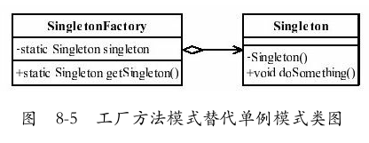

# 工厂方法模式（Factory Method Pattern）

- 工厂方法模式还可以与其他模式混合使用（例如模板方法模式、单例模式、原型模式等），变化出无穷的优秀设计，这也正是软件设计和开发的乐趣所在。

### 一、工厂方法模式的定义：
- `Define an interface for creating an object,but let subclasses decide which class to instantiate.Factory Method lets a class defer instantiation to subclasses`.
- 定义一个用于创建对象的接口，让子类决定实例化哪一个类。工厂方法使一个类的实例化延迟到其子类。

  

	- 在工厂方法模式中，抽象产品类Product负责定义产品的共性，实现对事物最抽象的定义；
	- Creator为抽象创建类，也就是抽象工厂，具体如何创建产品类是由具体的实现工厂ConcreteCreator完成的。

### 二、工厂方法模式的一个比较实用的通用源码
- 1、**抽象产品类**代码

  ```java
  public abstract class Product{
      //产品类的公共方法
      public void method1(){
          //业务逻辑处理
      }
      //抽象方法
      public abstract void method2();
  }
  ```
- 2、**具体的产品类**可以有多个，都继承于抽象产品类

  ```java
  public class ConcreteProduct1 extends Product{
      public void method2(){
          //业务逻辑处理
      }
  }
  
  public class ConcreteProduct2 extends Product{
      public void method2(){
          //业务逻辑处理
      }
  }
  ```
- 3、**抽象工厂类**负责定义产品对象的产生

  ```java
  public abstract class Creator{
      /*
       *创建一个产品对象，其输入参数类型可以自行设置
       *通常为String、Enum、Class等，当然也可以为空
       */
      public abstract<T extends Product>T createProduct(Class<T> c);
  }
  ```
- 4、具体如何产生一个产品的对象，是由**具体的工厂类**实现的

  ```java
  public class ConcreteCreator extends Creator{
      public<T extends Product>T createProduct(Class<T> c){
          Product product = null;
          try{
              product = (Product)Class.forName(c.getName()).newInstance();
          }catch(Exception e){
  			//异常处理
          }
          return (T)product;
      }
  }
  ```
- 5、场景类的调用方法
  ```java
  public class Client{
      public static void main(String[] args){
          Creator creator = new ConcreteCreator();
          Product product1 = creator.createProduct(ConcreteProduct1.class);
          Product product2 = creator.createProduct(ConcreteProduct2.class);
          /*
           *继续业务处理
           */
      }
  }
  ```

### 三、工厂方法模式的优点
- **良好的封装性，代码结构清晰**。
  - 一个对象创建是有条件约束的，如一个调用者需要一个具体的产品对象，只要知道这个产品的类名
  （或约束字符串）就可以了，不用知道创建对象的艰辛过程，降低模块间的耦合。
- 工厂方法模式的**扩展性**非常优秀。
  - 在增加产品类的情况下，只要适当地修改具体的工厂类或扩展一个工厂类，就可以完成“拥抱变化”。
  - 例如在我们的例子中，需要增加一个3号产品，则只需要增加一个`ConcreteProduct3`类，工厂类不用任何修改就可完成系统扩展。
- **屏蔽产品类**。
  - 这一特点非常重要，产品类的实现如何变化，调用者都不需要关心，它只需要关心产品的接口，只要接口保持不变，系统中的上层模块就不要发生变化。因为产品类的实例化工作是由工厂类负责的，一个产品对象具体由哪一个产品生成是由工厂类决定的。
  - 在数据库开发中，大家应该能够深刻体会到工厂方法模式的好处：如果使用JDBC连接数据库，数据库从MySQL切换到Oracle，需要改动的地方就是切换一下驱动名称（前提条件是SQL语句是标准语句），其他的都不需要修改，这是工厂方法模式灵活性的一个直接案例。
- 工厂方法模式是典型的**解耦框架**。
  - 高层模块只需要知道产品的抽象类，其他的实现类都不用关心，符合**迪米特法则**，我不需要的就不要去交流；
  - 也符合**依赖倒置原则**，只依赖产品类的抽象；
  - 当然也符合**里氏替换原则**，使用产品子类替换产品父类，没问题！


### 四、工厂方法模式的使用场景

- 首先，工厂方法模式是new一个对象的替代品，所以在**所有需要生成对象的地方都可以使用**，但是需要慎重地考虑是否要增加一个工厂类进行管理，增加代码的复杂度。
- 其次，**需要灵活的、可扩展的框架时**，可以考虑采用工厂方法模式。
  - 万物皆对象，那万物也就皆产品类，例如需要设计一个连接邮件服务器的框架，有三种网络协议可供选择：POP3、IMAP、HTTP，我们就可以把这三种连接方法作为产品类，定义一个接口如IConnectMail，然后定义对邮件的操作方法，用不同的方法实现三个具体的产品类（也就是连接方式）再定义一个工厂方法，按照不同的传入条件，选择不同的连接方式。如此设计，可以做到完美的扩展，如某些邮件服务器提供了WebService接口，很好，我们只要增加一个产品类就可以了。
- 再次，**工厂方法模式可以用在异构项目中**，
  - 例如通过WebService与一个非Java的项目交互，虽然WebService号称是可以做到异构系统的同构化，但是在实际的开发中，还是会碰到很多问题，如类型问题、WSDL文件的支持问题，等等。
  - 从WSDL中产生的对象都认为是一个产品，然后由一个具体的工厂类进行管理，减少与外围系统的耦合。
- 最后，**可以使用在测试驱动开发的框架下**。
  - 例如，测试一个类A，就需要把与类A有关联关系的类B也同时产生出来，我们可以使用工厂方法模式把类B虚拟出来，避免类A与类B的耦合。
  - 目前由于JMock和EasyMock的诞生，该使用场景已经弱化了，读者可以在遇到此种情况时直接考虑使用JMock或EasyMock。

### 五、JDK中的那些工厂方法模式
- 1、Collection中的iterator方法

  

	- java.util.Collection接口中定义了一个抽象的iterator()方法，该方法就是一个工厂方法。
	- 对于iterator()方法来说Collection就是一个根抽象工厂，下面还有List等接口作为抽象工厂，再往下有ArrayList等具体工厂。
	- java.util.Iterator接口是根抽象产品，下面有ListIterator等抽象产品，还有ArrayListIterator等作为具体产品。
	- 使用不同的具体工厂类中的iterator方法能得到不同的具体产品的实例。
- 2、JDBC数据库开发

  - 在使用JDBC进行数据库开发时，如果数据库由MySQL改为Oracle或其他，则只需要改一下数据库驱动名称就可以，其他都不用修改（前提是使用的都是标准SQL语句）。或者在Hibernate框架中，更换数据库方言也是类似道理。
- 3、连接邮件服务器框架

  - 如果需要设计一个连接邮件服务器的框架，那么就要考虑到连接邮件服务器有几种方式：POP3、SMTP、HTTP。就可以定义一个连接邮件服务器接口，在此接口中定义一些对邮件操作的接口方法，把这三种连接方式封装成产品类，实现接口中定义的抽象方法。再定义抽象工厂和具体工厂，当选择不同的工厂时，对应到产生相应的连接邮件产品对象。采用这种工厂方法模式的设计，就可以做到良好的扩展性。比如某些邮件服务器提供了WebService接口，只需要增加一个产品类和工厂类就可以了，而不需要修改原来代码。
- 4、其他工厂方法
  ```java
  java.lang.Proxy#newProxyInstance()
  java.lang.Object#toString()
  java.lang.Class#newInstance()
  java.lang.reflect.Array#newInstance()
  java.lang.reflect.Constructor#newInstance()
  java.lang.Boolean#valueOf(String)
  java.lang.Class#forName()
  ```
- 5、Spring框架中的Bean工厂，这是一个复杂对象，所以适合用工厂模式

  - 一般情况下,应用程序有自己的工厂对象来创建bean.如果将应用程序自己的工厂对象交给Spring管理,那么Spring管理的就不是普通的bean,而是工厂Bean。

### 六、工厂方法模式的扩展
#### 1、工厂方法模式

  

- 1)人类总称
  ```java
  public interface Human{
      //每个人种的皮肤都有相应的颜色
      public void getColor();
      //人类会说话
      public void talk();
  }
  ```
- 2)具体的人种
  ```java
  //白色人种
  public class WhiteHuman implements Human{
      public void getColor(){
          System.out.println("白色人种的皮肤颜色是白色的！");
      }
      public void tal(){
          System.out.println("白色人种会说话，一般都是但是单字节。");
      }
  }
  //黑色人种
  public class BlackHuman implements Human{
      public void getColo(){
          System.out.println("黑色人种的皮肤颜色是黑色的！");
      }
      public void talk(){
          System.out.println("黑人会说话，一般人听不懂。");
      }
  }
  //黄色人种
  public class YellowHuman implements Human{
      public void getColor(){
          System.out.println("黄色人种的皮肤颜色是黄色的！");
      }
      public void talk(){
          System.out.println("黄色人种会说话，一般说的都是双字节。");
      }
  }
  ```
- 3)抽象人类创建工厂
  ```java
  public abstract class AbstractHumanFactory{
      public abstract<T extends Human>T createHuman(Class<T> c);
  }
  ```
- 4)人类创建工厂
  ```java
  public class HumanFactory extends AbstractHumanFactory{
      public <T extends Human>T createHuman(Class<T> c){
          //定义一个生产的人种
          Human human=null;
          try{
              //产生一个人种
              human = (Human)Class.forName(c.getName()).newInstance();
          }catch(Exception e){
              System.out.println("人种生成错误！");
          }
          return (T)human;
      }
  }
  ```
- 5、女娲类

  ```java
  public class NvWa {
      public static void main(String[] args) {
          //声明阴阳八卦炉
          AbstractHumanFactory YinYangLu = new HumanFactory();
          //女娲第一次造人，火候不足，于是白人产生了
          System.out.println("--造出的第一批人是白色人种--");
          Human whiteHuman = YinYangLu.createHuman(WhiteHuman.class);
          whiteHuman.getColor();
          whiteHuman.talk();
          //女娲第二次造人，火候过足，于是黑人产生了
          System.out.println("\n--造出的第二批人是黑色人种--");
          Human blackHuman = YinYangLu.createHuman(BlackHuman.class);
          blackHuman.getColor();
          blackHuman.talk();
          //第三次造人，火候刚刚好，于是黄色人种产生了
          System.out.println("\n--造出的第三批人是黄色人种--");
          Human yellowHuman = YinYangLu.createHuman(YellowHuman.class);
          yellowHuman.getColor();
          yellowHuman.talk();
      }
      /**
       *
       * --造出的第一批人是白色人种--
       * 白色人种的皮肤颜色是白色的！
       * 白色人种会说话，一般都是但是单字节。
       * --造出的第二批人是黑色人种--
       * 黑色人种的皮肤颜色是黑色的！
       * 黑人会说话，一般人听不懂。
       * --造出的第三批人是黄色人种--
       * 黄色人种的皮肤颜色是黄色的！
       * 黄色人种会说话，一般说的都是双字节。
       */
  }
  ```


#### 2、缩小为简单工厂模式（静态工厂模式）
- 一个模块仅需要一个工厂类，没有必要把它产生出来，使用**静态的方法**就可以了

- 该模式是工厂方法模式的弱化，因为简单，所以称为简单工厂模式（Simple Factory Pattern），也叫做静态工厂模式。

- 在实际项目中，采用该方法的案例还是比较多的，其缺点是工厂类的扩展比较困难，**不符合开闭原则**，但它仍然是一个非常实用的设计模式。

  

    - 在类图中去掉了AbstractHumanFactory抽象类，同时把createHuman方法设置为静态类型，简化了类的创建过程，变更的源码仅仅是HumanFactory和NvWa类
    - 1)简单工厂模式中的工厂类
      ```java
      public class HumanFactory{
          public static<T extends Human>T createHuman(Class<T> c){
              //定义一个生产出的人种
              Human human = null;
              try{
                  //产生一个人种
                  human=(Human)Class.forName(c.getName()).newInstance();
              }catch(Exception e){
                  System.out.println("人种生成错误！");
              }
              return (T)human;
          }
      }
      ```
    - 2)简单工厂模式中的场景类
      ```java
      public class NvWa {
          public static void main(String[] args) {
              //女娲第一次造人，火候不足，于是白人产生了
              System.out.println("--造出的第一批人是白色人种--");
              Human whiteHuman = HumanFactory.createHuman(WhiteHuman.class);
              whiteHuman.getColor();
              whiteHuman.talk();
              //女娲第二次造人，火候过足，于是黑人产生了
              System.out.println("\n--造出的第二批人是黑色人种--");
              Human blackHuman = HumanFactory.createHuman(BlackHuman.class);
              blackHuman.getColor();
              blackHuman.talk();
              //第三次造人，火候刚刚好，于是黄色人种产生了
              System.out.println("\n--造出的第三批人是黄色人种--");
              Human yellowHuman = HumanFactory.createHuman(YellowHuman.class);
              yellowHuman.getColor();
              yellowHuman.talk();
          }
      }
      ```

#### 3、升级为多个工厂类
- 当我们在做一个比较复杂的项目时，经常会遇到初始化一个对象很耗费精力的情况，所有的产品类都放到一个工厂方法中进行初始化会使代码结构不清晰。
- 例如，一个产品类有5个具体实现，每个实现类的初始化（不仅仅是new，初始化包括new一个对象，并对对象设置一定的初始值）方法都不相同，如果写在一个工厂方法中，势必会导致该方法巨大无比。
- 考虑到需要结构清晰，我们就**为每个产品定义一个创造者**，然后由调用者自己去选择与哪个工厂方法关联。

    

    - 每个人种（具体的产品类）都对应了一个创建者，每个创建者都独立负责创建对应的产品对象，**非常符合单一职责原则**。

    - 抽象方法中已经不再需要传递相关参数了，因为每一个具体的工厂都已经非常明确自己的职责：创建自己负责的产品类对象。

    - 1)多工厂模式的抽象工厂类
      ```java
      public abstract class AbstractHumanFactory{
          public abstract Human createHuman();
      }
      ```

    - 2)具体的人类创建工厂
      ```java
      //黑色人种的创建工厂实现
      public class BlackHumanFactory extends AbstractHumanFactory{
          public Human createHuman(){
              return new BlackHuman();
          }
      }
      //白色人种的创建类
      public class WhiteHumanFactory extends AbstractHumanFactory{
          public Human createHuman(){
              return new WhiteHuman();
          }
      }
      //黄色人种的创建类
      public class YellowHumanFactory extends AbstractHumanFactory{
          public Human createHuman(){
              return new YellowHuman();
          }
      }
      ```

    - 3)场景类NvWa
      ```java
      public class NvWa {
          public static void main(String[] args) {
              //女娲第一次造人，火候不足，于是白人产生了
              System.out.println("--造出的第一批人是白色人种--");
              Human whiteHuman = (new WhiteHumanFactory()).createHuman();
              whiteHuman.getColor();
              whiteHuman.talk();
              //女娲第二次造人，火候过足，于是黑人产生了
              System.out.println("\n--造出的第二批人是黑色人种--");
              Human blackHuman = (new BlackHumanFactory()).createHuman();
              blackHuman.getColor();
              blackHuman.talk();
              //第三次造人，火候刚刚好，于是黄色人种产生了
              System.out.println("\n--造出的第三批人是黄色人种--");
              Human yellowHuman = (new YellowHumanFactory()).createHuman();
              yellowHuman.getColor();
              yellowHuman.talk();
          }
      }
      ```
    - 每一个产品类都对应了一个创建类，**好处**就是创建类的职责清晰，而且结构简单，但是**给可扩展性和可维护性带来了一定的影响**。为什么这么说呢？如果要扩展一个产品类，就需要建立一个相应的工厂类，这样就增加了扩展的难度。因为工厂类和产品类的数量相同，维护时需要考虑两个对象之间的关系。
    - 当然，在复杂的应用中一般采用多工厂的方法，然后再增加一个协调类，避免调用者与各个子工厂交流，协调类的作用是封装子工厂类，对高层模块提供统一的访问接口。

#### 4、替代单例模式

  
    

- Singleton定义了一个private的无参构造函数，目的是不允许通过new的方式创建一个对象。

- Singleton保证不能通过正常的渠道建立一个对象，那SingletonFactory如何建立一个单例对象呢？答案是通过反射方式创建。

- SingletonFactory通过获得类构造器，然后设置访问权限，生成一个对象，然后提供外部访问，保证内存中的对象唯一。

- 通过工厂方法模式创建了一个单例对象，该框架可以继续扩展，在一个项目中可以产生一个单例构造器，所有需要产生单例的类都遵循一定的规则（构造方法是private），然后通过扩展该框架，只要输入一个类型就可以获得唯一的一个实例。

- 1)单例类
  ```java
  public class Singleton{
      //不允许通过new产生一个对象
      private Singleton(){
          
      }
      public void doSomething(){
          //业务处理
      }
  }
  ```

- 2)负责生成单例的工厂类

  ```java
  public class SingletonFactory{
      private static Singleton singleton;
      static{
          try{
              Class cl = Class.forName(Singleton.class.getName());
              //获得无参构造
              Constructor constructor = cl.getDeclaredConstructor();
              //设置无参构造是可访问的
              constructor.setAccessible(true);
              //产生一个实例对象
              singleton = (Singleton)constructor.newInstance();
          }catch(Exception e){
              //异常处理
          }
      }
      public static Singleton getSingleton(){
          return singleton;
      }
  }
  ```

#### 5、延迟初始化
- 何为延迟初始化（Lazy initialization）？一个对象被消费完毕后，并不立刻释放，工厂类保持其初始状态，等待再次被使用。延迟初始化是工厂方法模式的一个扩展应用。

    

    - ProductFactory负责产品类对象的创建工作，并且通过prMap变量产生一个缓存，对需要再次被重用的对象保留。
    - 通过定义一个Map容器，容纳所有产生的对象，如果在Map容器中已经有的对象，则直接取出返回；如果没有，则根据需要的类型产生一个对象并放入到Map容器中，以方便下次调用。

- 延迟加载的工厂类

  ```java
  public class ProductFactory{
      private static final Map<String,Product> prMap = new HashMap();
      public static synchronized Product createProduct(String type) throws Exception{
          Product product = null;
          //如果Map中已经有这个对象
          if(prMap.containsKey(type)){
              product = prMap.get(type);
          }else{
              if(type.equals("Product1")){
                  product = new ConcreteProduct1();
              }else{
                  product = new ConcreteProduct2();
              }
              //同时把对象放到缓存容器中
              prMap.put(type,product);
          }
          return product;
      }
  }
  ```

- 延迟加载框架是可以扩展的，例如限制某一个产品类的最大实例化数量，可以通过判断Map中已有的对象数量来实现，这样的处理是非常有意义的，例如JDBC连接数据库，都会要求设置一个MaxConnections最大连接数量，该数量就是内存中最大实例化的数量。
- 延迟加载还可以用在对象初始化比较复杂的情况下，例如硬件访问，涉及多方面的交互，则可以通过延迟加载降低对象的产生和销毁带来的复杂性。

### 七、最佳实践
- 工厂方法模式在项目中使用得非常频繁，以至于很多代码中都包含工厂方法模式。
- 该模式几乎尽人皆知，但不是每个人都能用得好。
- 熟能生巧，熟练掌握该模式，多思考工厂方法如何应用，而且工厂方法模式还可以与其他模式混合使用（例如模板方法模式、单例模式、原型模式等），变化出无穷的优秀设计，这也正是软件设计和开发的乐趣所在。


