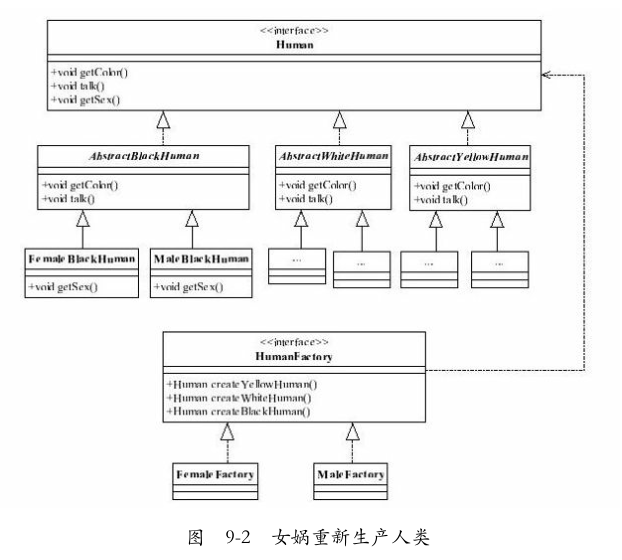
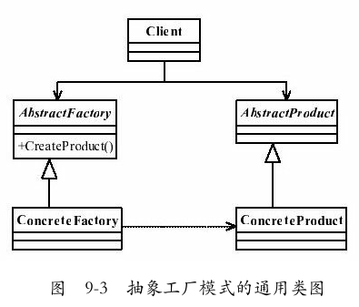
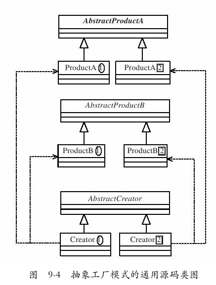
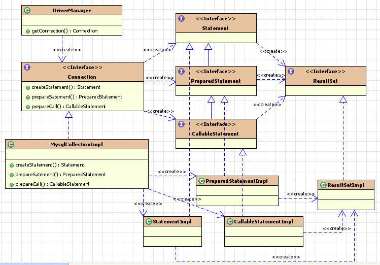

# 抽象工厂模式

- 工厂方法模式有一个问题就是，类的创建依赖工厂类，也就是说，如果想要拓展程序，必须对工厂类进行修改，这违背了闭包原则，所以，从设计角度考虑，有一定的问题，如何解决？就用到**抽象工厂模式**，创建多个工厂类，这样一旦需要增加新的功能，直接增加新的工厂类就可以了，不需要修改之前的代码。
- **抽象工厂模式与工厂方法模式的区别**
  - 抽象工厂模式是工厂方法模式的升级版本，他用来创建一组相关或者相互依赖的对象。
  - 他与工厂方法模式的**区别**就在于，工厂方法模式针对的是**一个产品等级结构**；而抽象工厂模式则是针对的**多个产品等级结构**。
  - 在编程中，通常一个产品结构，表现为一个接口或者抽象类，也就是说，**工厂方法模式提供的所有产品都是衍生自同一个接口或抽象类，而抽象工厂模式所提供的产品则是衍生自不同的接口或抽象类**。



### 一、抽象工厂模式的定义
- `Provide an interface for creating families of related or dependent objects without specifying their concrete classes`.
- 为创建一组相关或相互依赖的对象提供一个接口，而且无需指定它们的具体类。

	

- **抽象工厂模式是工厂方法模式的升级版本**，在有多个业务品种、业务分类时，通过抽象工厂模式产生需要的对象是一种非常好的解决方式。

### 二、抽象工厂模式的一个比较实用的通用源码
- 首先有两个互相影响的产品线（也叫做产品族），例如制造汽车的左侧门和右侧门，这两个应该是数量相等的——两个对象之间的约束，每个型号的车门都是不一样的，这是产品等级结构约束的，我们先看看两个产品族的类图，如图9-4所示。

	

	- 注意类图上的圈圈、框框相对应，两个抽象的产品类可以有关系，例如共同继承或实现一个抽象类或接口。
- 1、抽象产品类A

  ```java
  public abstract class AbstractProductA{
      //每个产品共有的方法
      public void shareMethod(){
          
      }
      //每个产品相同方法，不同实现
      public abstract void doSomething();
  }
  ```
- 2、产品A1的实现类
  ```java
  public class ProductA1 extends AbstractProductA{
      public void doSomething(){
          System.out.println("产品A1的实现方法");
      }
  }
  ```
- 3、产品A2的实现类
  ```java
  public class ProductA2 extends AbstractProductA{
      public void doSomething(){
          System.out.println("产品A2的实现方法");
      }
  }
  ```
- 4、产品B与此类似，不再赘述。
- 5、抽象工厂类AbstractCreator的职责是定义每个工厂要实现的功能，在通用代码中，抽象工厂类定义了两个产品族的产品创建。（抽象工厂类）

  ```java
  public abstract class AbstractCreator{
      //创建A产品家族
      public abstract AbstractProductA createProductA();
      //创建B产品家族
      public abstract AbstractProductB createProductB();
  }
  ```
  - 注意：有N个产品族，在抽象工厂类中就应该有N个创建方法。
  - 如何创建一个产品，则是由具体的实现类来完成的，Creator1和Creator2如下。
- 6、产品等级1的实现类
  ```java
  public class Creator1 extends AbstractCreator {
      //只生产产品等级为1的A产品
      public AbstractProductA createProductA(){
          return new ProductA1();
      }
      //只生产产品等级为1的B产品
      public AbstractProductB createProductB(){
          return new ProductB1();
      }
  }
  ```
- 6、产品等级2的实现类
  ```java
  public class Creator2 extends AbstractCreator{
      //只生产产品等级为2的A产品
      public AbstractProductA createProductA(){
          return new ProductA2();
      }
      //只生产产品等级为2的B产品
      public AbstractProductB createProductB(){
          return new ProductB2();
      }
  }
  ```
	- 注意：有M个产品等级就应该有M个实现工厂类，在每个实现工厂中，实现不同产品族的生产任务。
- 7、场景类
  ```java
  public class Client{
      public static void main(String[] args){
          //定义出两个工厂
          AbstractCreator creator1 = new Creator1();
          AbstractCreator creator2 = new Creator2();
          //产生A1对象
          AbstractProductA a1 = creator1.createProductA();
          //产生A2对象
          AbstractProductA a2 = creator2.createProductA();
          //产生B1对象
          AbstractProductB b1 = creator1.createProductB();
          //产生B2对象
          AbstractProductB b2 = creator2.createProductB();
          /*
           *然后在这里就可以为所欲为了……
           */
      }
  }
  ```
	- 在具体的业务中如何产生一个与实现无关的对象呢？
	- 在场景类中，没有任何一个方法与实现类有关系，对于一个产品来说，我们只要知道它的工厂方法就可以直接产生一个产品对象，无需关心它的实现类。

### 三、抽象工厂模式的优点
- **封装性**，每个产品的实现类不是高层模块要关心的，**它要关心的是接口，是抽象**，它不关心对象是如何创建出来，这由工厂类负责的，只要知道工厂类是谁，我们就能创建出一个需要的对象，省时省力，优秀设计就应该如此。
- **产品族内的约束为非公开状态**。例如生产男女比例的问题上，猜想女娲娘娘肯定有自己的打算，不能让女盛男衰，否则女性的优点就体现不出来了。
	- 那在抽象工厂模式，就应该有这样的一个约束：每生产1个女性，就同时生产出1.2个男性，这样的生产过程对调用工厂类的高层模块来说是透明的，它不需要知道这个约束，我就是要一个黄色女性产品就可以了，具体的产品族内的约束是在工厂内实现的。

### 四、抽象工厂模式的缺点
- **抽象工厂模式的最大缺点就是产品族扩展非常困难**，
- 为什么这么说呢？我们以通用代码为例，如果要增加一个产品C，也就是说产品家族由原来的2个增加到3个，看看我们的程序有多大改动吧！
- 抽象类AbstractCreator要增加一个方法createProductC（），然后两个实现类都要修改，想想看，这**严重违反了开闭原则**，而且我们一直说明抽象类和接口是一个契约。改变契约，所有与契约有关系的代码都要修改，那么这段代码叫什么？叫“有毒代码”，——只要与这段代码有关系，就可能产生侵害的危险！

### 五、抽象工厂模式的使用场景

- 抽象工厂模式的使用场景定义非常简单：**一个对象族（或是一组没有任何关系的对象）都有相同的约束，则可以使用抽象工厂模式**。
- 什么意思呢？例如一个文本编辑器和一个图片处理器，都是软件实体，但是`*nix`下的文本编辑器和Windows下的文本编辑器虽然功能和界面都相同，但是代码实现是不同的，图片处理器也有类似情况。也就是具有了共同的约束条件：操作系统类型。于是我们可以使用**抽象工厂模式**，产生不同操作系统下的编辑器和图片处理器。

### 六、JDK中的那些抽象工厂模式
- 1、java.sql包
	- 当注册驱动程序时，java.sql接口都从JDBC JAR获取其具体实现。

  

- 2、UIManager（swing外观）
- 3、其他抽象工厂方法

  - 可以通过创建方法识别返回工厂本身，而工厂本身又可用于创建另一个抽象/接口类型。（javadoc类具有'工厂'）
  ```java
  java.util.Calendar#getInstance()
  java.util.Arrays#asList()
  java.util.ResourceBundle#getBundle()
  java.sql.DriverManager#getConnection()
  java.sql.Connection#createStatement()
  java.sql.Statement#executeQuery()
  java.text.NumberFormat#getInstance()
  javax.xml.parsers.DocumentBuilderFactory#newInstance()
  javax.xml.transform.TransformerFactory#newInstance()
  javax.xml.xpath.XPathFactory#newInstance()
  DatagramSocketImplFactory, PreferencesFactory 
  ```

### 七、抽象工厂模式的注意事项
- 在抽象工厂模式的缺点中，我们提到抽象工厂模式的产品族扩展比较困难，但是一定要清楚，**是产品族扩展困难，而不是产品等级**。
- 在该模式下，**产品等级是非常容易扩展的**，增加一个产品等级，只要增加一个工厂类负责新增加出来的产品生产任务即可。也就是说**横向扩展容易，纵向扩展困难**。
- 以人类为例子，产品等级中只有男、女两个性别，现实世界还有一种性别：双性人，既是男人也是女人（俗语就是阴阳人），那我们要扩展这个产品等级也是非常容易的，增加三个产品类，分别对应不同的肤色，然后再创建一个工厂类，专门负责不同肤色人的双性人的创建任务，完全通过扩展来实现需求的变更，**从这一点上看，抽象工厂模式是符合开闭原则的**。

### 八、最佳实践
- 一个模式在什么情况下才能够使用，是很多读者比较困惑的地方。
- 抽象工厂模式是一个简单的模式，使用的场景非常多，大家**在软件产品开发过程中，涉及不同操作系统的时候，都可以考虑使用抽象工厂模式**，例如一个应用，需要在三个不同平台（Windows、Linux、Android（Google发布的智能终端操作系统））上运行，你会怎么设计？分别设计三套不同的应用？非也，通过抽象工厂模式屏蔽掉操作系统对应用的影响。三个不同操作系统上的软件功能、应用逻辑、UI都应该是非常类似的，唯一不同的是调用不同的工厂方法，由不同的产品类去处理与操作系统交互的信息。