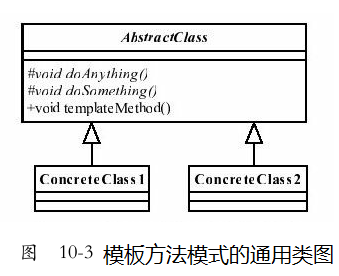
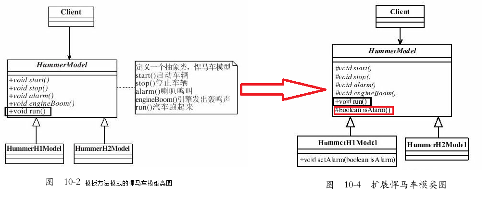

# 模板方法模式（Template Method Pattern）

### 一、模板方法模式的定义
- `Define the skeleton of an algorithm in an operation,deferring some steps to subclasses.Template Method lets subclasses redefine certain steps of an algorithm without changing the algorithm's structure`.

- 定义一个操作中的算法的框架，而将一些步骤延迟到子类中。使得子类可以不改变一个算法的结构即可重定义该算法的某些特定步骤。

  

  - 模板方法模式确实非常简单，仅仅使用了Java的继承机制，但它是一个应用非常广泛的模式。
  - 其中，AbstractClass叫做抽象模板，它的方法分为两类：
    - 基本方法：基本方法也叫做基本操作，是由子类实现的方法，并且在模板方法被调用。
    - 模板方法：可以有一个或几个，一般是一个具体方法，也就是一个框架，实现对基本方法的调度，完成固定的逻辑。
  - 注意：为了防止恶意的操作，一般模板方法都**加上final关键字，不允许被覆写**。
  - 在类图中还有一个角色：具体模板。ConcreteClass1和ConcreteClass2属于具体模板，实现父类所定义的一个或多个抽象方法，也就是父类定义的基本方法在子类中得以实现。

### 二、模板办法模式的一个比较实用的通用源码
- 抽象模板类
  ```java
  public abstract class AbstractClass{
      //基本方法
      protected abstract void doSomething();
      //基本方法
      protected abstract void doAnything();
      //模板方法
      public final void templateMethod(){
          /*
           *调用基本方法，完成相关的逻辑
           */
          this.doAnything();
          this.doSomething();
      }
  }
  ```
- 具体模板类
  ```java
  public class ConcreteClass1 extends AbstractClass{
      //实现基本方法
      protected void doAnything(){
          //业务逻辑处理
      }
      protected void doSomething(){
          //业务逻辑处理
      }
  }
  
  public class ConcreteClass2 extends AbstractClass{
      //实现基本方法
      protected void doAnything(){
          //业务逻辑处理
      }
      protected void doSomething(){
          //业务逻辑处理
      }
  }
  ```
- 场景类
  ```java
  public class Client{
      public static void main(String[] args){
          AbstractClass class1 = new ConcreteClass1();
          AbstractClass class2 = new ConcreteClass2();
          //调用模板方法
          class1.templateMethod();
          class2.templateMethod();
      }
  }
  ```
- 注意：抽象模板中的基本方法尽量设计为protected类型，符合迪米特法则，不需要暴露的属性或方法尽量不要设置为protected类型。实现类若非必要，尽量不要扩大父类中的访问权限。

### 三、模板方法模式的优点
- **封装不变部分，扩展可变部分**
  - 把认为是不变部分的算法封装到父类实现，而可变部分的则可以通过继承来继续扩展。
  - 在悍马模型例子中，是不是就非常容易扩展？例如增加一个H3型号的悍马模型，很容易呀，增加一个子类，实现父类的基本方法就可以了。
- **提取公共部分代码，便于维护**
- **行为由父类控制，子类实现**
  - 基本方法是由子类实现的，因此子类可以通过扩展的方式增加相应的功能，符合开闭原则。

### 四、模板方法模式的缺点
- 按照我们的设计习惯，抽象类负责声明最抽象、最一般的事物属性和方法，实现类完成具体的事物属性和方法。
- 但是模板方法模式却颠倒了，抽象类定义了部分抽象方法，由子类实现，子类执行的结果影响了父类的结果，也就是子类对父类产生了影响，这在复杂的项目中，会带来代码阅读的难度，而且也会让新手产生不适感。

### 五、模板方法模式的使用场景
- 多个子类有公有的方法，并且逻辑基本相同时。
- 重要、复杂的算法，可以把核心算法设计为模板方法，周边的相关细节功能则由各个子类实现。
- 重构时，模板方法模式是一个经常使用的模式，把相同的代码抽取到父类中，然后通过钩子函数（见“模板方法模式的扩展”）约束其行为。

### 六、JDK中的那些模板方法模式
- 定义算法框架，并将一些步骤的实现延迟到子类。通过模板方法，子类可以重新定义算法的某些步骤，而不用改变算法的结构。
  ```java
  java.util.Collections#sort()
  java.io.InputStream#skip()
  java.io.InputStream#read()
  java.util.AbstractList#indexOf()
  ```

### 七、模板方法模式的扩展

  

- 扩展后的抽象模板类
  ```java
  public abstract class HummerModel{
      /*
      *首先，这个模型要能够被发动起来，别管是手摇发动，还是电力发动，反正
      *是要能够发动起来，那这个实现要在实现类里了
      */
      protected abstract void start();
      //能发动，那还要能停下来，那才是真本事
      protected abstract void stop();
      //喇叭会出声音，是滴滴叫，还是哔哔叫
      protected abstract void alarm();
      //引擎会轰隆隆的响，不响那是假的
      protected abstract void engineBoom();
      //那模型应该会跑吧，别管是人推的，还是电力驱动，总之要会跑
      final public void run(){
          //先发动汽车
          this.start();
          //引擎开始轰鸣
          this.engineBoom();
          //要让它叫的就是就叫，喇嘛不想让它响就不响
          if(this.isAlarm()){
              this.alarm();
          }
          //到达目的地就停车
          this.stop();
      }
      //钩子方法，默认喇叭是会响的
      protected boolean isAlarm(){
          return true;
      }
  }
  ```

- 扩展后的H1悍马
  ```java
  public class HummerH1Model extends HummerModel{
      private boolean alarmFlag = true;//要响喇叭
      protected void alarm(){
          System.out.println("悍马H1鸣笛……");
      }
      protected void engineBoom(){
          System.out.println("悍马H1引擎声音是这样在……");
      }
      protected void start(){
          System.out.println("悍马H1发动……");
      }
      protected void stop(){
          System.out.println("悍马H1停车……");
      }
      protected boolean isAlarm(){
          return this.alarmFlag;
      }
      //要不要响喇叭，是有客户的来决定的
      public void setAlarm(boolean isAlarm){
          this.alarmFlag = isAlarm;
      }
  }
  ```

- 扩展后的H2悍马
  ```java
  public class HummerH2Model extends HummerModel{
      protected void alarm(){
          System.out.println("悍马H2鸣笛……");
      }
      protected void engineBoom(){
          System.out.println("悍马H2引擎声音是这样在……");
      }
      protected void start(){
          System.out.println("悍马H2发动……");
      }
      protected void stop(){
          System.out.println("悍马H2停车……");
      }
      //默认没有喇叭的
      protected boolean isAlarm(){
          return false;
      }
  }
  ```

- 扩展后的场景类
  ```java
  import java.io.BufferedReader;
  import java.io.IOException;
  import java.io.InputStreamReader;
  
  public class Client{
      public static void main(String[] args)throws IOException{
          System.out.println("-------H1型号悍马--------");
          System.out.println("H1型号的悍马是否需要喇叭声响？0-不需要1-需要");
          String type = (new BufferedReader(new InputStreamReader(System.in))).readLine();
          HummerH1Model h1 = new HummerH1Model();
          if(type.equals("0")){
              h1.setAlarm(false);
          }
          h1.run();
          System.out.println("\n-------H2型号悍马--------");
          HummerH2Model h2 = new HummerH2Model();
          h2.run();
  
          /**
           * -------H1型号悍马--------
           * H1型号的悍马是否需要喇叭声响？0-不需要1-需要
           * 0
           * 悍马H1发动……
           * 悍马H1引擎声音是这样在……
           * 悍马H1停车……
           *
           * -------H2型号悍马--------
           * 悍马H2发动……
           * 悍马H2引擎声音是这样在……
           * 悍马H2停车……
           */
  
          /**
           *-------H1型号悍马--------
           * H1型号的悍马是否需要喇叭声响？0-不需要1-需要
           * 1
           * 悍马H1发动……
           * 悍马H1引擎声音是这样在……
           * 悍马H1鸣笛……
           * 悍马H1停车……
           *
           * -------H2型号悍马--------
           * 悍马H2发动……
           * 悍马H2引擎声音是这样在……
           * 悍马H2停车……
           */
      }
  }
  ```

- 外界条件改变，影响到模板方法的执行。在我们的抽象类中isAlarm的返回值就是影响了模板方法的执行结果，该方法就叫做钩子方法（Hook Method）。

- **有了钩子方法模板方法模式才算完美**。

- 模板方法模式就是在模板方法中按照一定的规则和顺序调用基本方法，具体到前面那个例子，就是run（）方法按照规定的顺序（先调用start（），然后再调用engineBoom（），再调用alarm（），最后调用stop（））调用本类的其他方法，并且由isAlarm（）方法的返回值确定run（）中的执行顺序变更。

### 八、最佳实践
- 父类怎么调用子类的方法？
  - 不可用的方法：
      - 把子类传递到父类的有参构造中，然后调用。
      - 使用反射的方式调用，你使用了反射还有谁不能调用的？！
      - 父类调用子类的静态方法。
      - 这三种都是父类直接调用子类的方法，好用不？好用！解决问题了吗？解决了！项目中允许使用不？不允许！
  - **可用的方法**：
  	- 其实这个问题可以换个角度去理解，父类建立框架，子类在重写了父类部分的方法后，再调用从父类继承的方法，产生不同的结果（而这正是**模板方法模式**）。
  	- 这是不是也可以理解为父类调用了子类的方法呢？你修改了子类，影响了父类行为的结果，曲线救国的方式实现了父类依赖子类的场景，模板方法模式就是这种效果。
- 模板方法在一些开源框架中应用非常多
  - 它提供了一个抽象类，然后开源框架写了一堆子类。在《XXX In Action》中就说明了，如果你需要扩展功能，可以继承这个抽象类，然后覆写protected方法，再然后就是调用一个类似execute方法，就完成你的扩展开发，非常容易扩展的一种模式。
