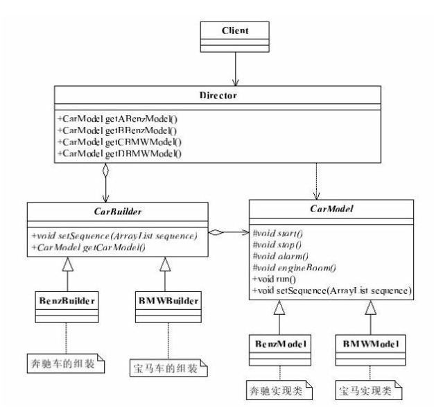
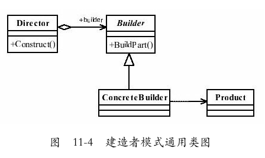

# 建造者模式（Builder Pattern）也叫生成器模式

- 建造者模式关注的是零件类型和装配工艺（顺序），这是它与工厂方法模式最大不同的地方，虽然同为创建类模式，但是注重点不同。



### 一、建造者模式的定义
- `Separate the construction of a complex object from its representation so that the same construction process can create different representations`.
- 将一个复杂对象的构建与它的表示分离，使得同样的构建过程可以创建不同的表示。

  

- 在建造者模式中，有如下4个角色：

  - Product产品类
    - 通常是实现了模板方法模式，也就是有模板方法和基本方法。
    - 例子中的BenzModel和BMWModel就属于产品类。
  - Builder抽象建造者
    - 规范产品的组建，一般是由子类实现。
    - 例子中的CarBuilder就属于抽象建造者。
  - ConcreteBuilder具体建造者
    - 实现抽象类定义的所有方法，并且返回一个组建好的对象。
    - 例子中的BenzBuilder和BMWBuilder就属于具体建造者。
  - Director导演类
    - 负责安排已有模块的顺序，然后告诉Builder开始建造。

### 二、建造者模式的通用源代码
- 产品类
  ```java
  public class Product{
      public void doSomething(){
          //独立业务处理
      }
  }
  ```

- 抽象建造者
  ```java
  public abstract class Builder{
      //设置产品的不同部分，以获得不同的产品
      public abstract void setPart();
      //建造产品
      public abstract Product buildProduct();
  }
  ```
  - 其中，setPart方法是零件的配置，什么是零件？其他的对象，获得一个不同零件，或者不同的装配顺序就可能产生不同的产品。

- 具体建造者
  ```java
  public class ConcreteProduct extends Builder{
      private Product product = new Product();
      //设置产品零件
      public void setPart(){
          /*
           *产品类内的逻辑处理
           */
      }
      //组建一个产品
      public Product buildProduct(){
          return product;
      }
  }
  ```
  - 需要注意的是，如果有多个产品类就有几个具体的建造者，而且这多个产品类具有相同接口或抽象类。
- 导演类
  ```java
  public class Director{
      private Builder builder = new ConcreteProduct();
      //构建不同的产品
      public Product getAProduct(){
          builder.setPart();
          /*
           *设置不同的零件，产生不同的产品
           */
          return builder.buildProduct();
      }
  }
  ```
  - 导演类起到封装的作用，避免高层模块深入到建造者内部的实现类。
  - 当然，在建造者模式比较庞大时，导演类可以有多个。

### 三、建造者模式的优点
- 封装性
  - 使用建造者模式可以使客户端不必知道产品内部组成的细节，
  - 如例子中我们就不需要关心每一个具体的模型内部是如何实现的，产生的对象类型就是CarModel。
- 建造者独立，容易扩展
  - BenzBuilder和BMWBuilder是相互独立的，对系统的扩展非常有利。
- 便于控制细节风险
  - 由于具体的建造者是独立的，因此可以对建造过程逐步细化，而不对其他的模块产生任何影响。

### 四、建造者模式的使用场景

- 相同的方法，不同的执行顺序，产生不同的事件结果时，可以采用建造者模式。
- 多个部件或零件，都可以装配到一个对象中，但是产生的运行结果又不相同时，则可以使用该模式。
- 产品类非常复杂，或者产品类中的调用顺序不同产生了不同的效能，这个时候使用建造者模式非常合适。
- 在对象创建过程中会使用到系统中的一些其他对象，这些对象在产品对象的创建过程中不易得到时，也可以采用建造者模式封装该对象的创建过程。
	- 该种场景只能是一个补偿方法，因为一个对象不容易获得，而在设计阶段竟然没有发觉，而要通过创建者模式柔化创建过程，本身已经违反设计的最初目标。

### 五、JDK中的那些建造者模式
- 定义一个新的类来构造另一个类的实例，以创建一个复杂的对象。
- 它可以封装一个对象的构造过程，并允许按步骤构造。
  ```java
  java.lang.StringBuilder#append()
  java.lang.StringBuffer#append()
  java.sql.PreparedStatement
  javax.swing.GroupLayout.Group#addComponent()
  ```

### 六、建造者模式的注意事项
- 建造者模式关注的是零件类型和装配工艺（顺序），这是它与工厂方法模式最大不同的地方，虽然同为创建类模式，但是注重点不同。

### 七、建造者模式的扩展
- 建造者模式中还有一个角色没有说明，就是零件，建造者怎么去建造一个对象？是零件的组装，组装顺序不同对象效能也不同，这才是建造者模式要表达的核心意义，而怎么才能更好地达到这种效果呢？**引入模板方法模式是一个非常简单而有效的办法**。
- 建造者模式和工厂模式非常相似
  - 建造者模式最主要的功能是基本方法的调用顺序安排，也就是这些基本方法已经实现了，通俗地说就是零件的装配，顺序不同产生的对象也不同；
  - 而工厂方法则重点是创建，创建零件是它的主要职责，组装顺序则不是它关心的。

### 八、最佳实践

- 在使用建造者模式的时候考虑一下模板方法模式，别孤立地思考一个模式，僵化地套用一个模式会让你受害无穷！
- 在使用建造者模式的时候考虑一下模板方法模式，比单独使用建造者是高效、简洁得多。