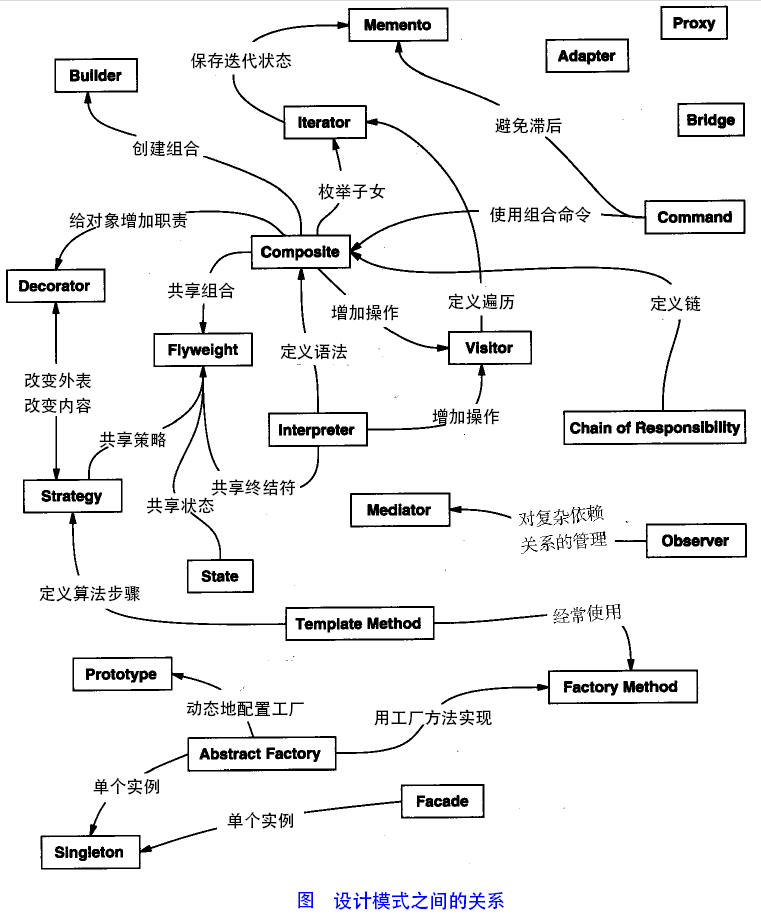

# DesignPattern
- [类图中的关系](https://github.com/sunnyandgood/StudyNotes/blob/master/软件工程导论/第十章、面向对象需求分析/第十章面向对象需求分析.md#103-类图中类关系的画法)
* [六大设计原则](./六大设计原则.md)

### 一、设计模式

<table>
<tr>
     <th rowspan="5" width="300px" align="left">创建型模式:（5种） 这些设计模式提供了一种在创建对象的同时隐藏创建逻辑的方式，而不是使用 new 运算符直接实例化对象。这使得程序在判断针对某个给定实例需要创建哪些对象时更加灵活。</th>
     <td width="400px"><a href="./1、单例模式.md">单例模式（Singleton Pattern）</a></td>
  </tr>
  <tr>
    <td><a href="./6、工厂方法模式.md">工厂方法模式（Factory Pattern）</a></td>
  </tr>
  <tr>
    <td><a href="./7、抽象工厂模式.md">抽象工厂模式（Abstract Factory Pattern）</a></td>
  </tr>
  <tr>
    <td><a href="./9、建造者模式.md">建造者模式（Builder Pattern）</a></td>
  </tr>
  <tr>
    <td><a href="">原型模式（Prototype Pattern）</a></td>
  </tr>
  <tr>
     <th rowspan="8" width="300px" align="left">结构型模式:（7种+过滤器模式） 这些设计模式关注类和对象的组合。继承的概念被用来组合接口和定义组合对象获得新功能的方式。</th>
     <td width="400px"><a href="./3、代理模式.md">代理模式（Proxy Pattern）</a></td>
  </tr>
  <tr>
    <td><a href="./5、装饰模式(Decorator).md">装饰器模式（Decorator Pattern）</a></td>
  </tr>
  <tr>
    <td><a href="">适配器模式（Adapter Pattern）</a></td>
  </tr>
  <tr>
    <td><a href="">桥接模式（Bridge Pattern）</a></td>
  </tr>
  <tr>
    <td><a href="">组合模式（Composite Pattern）</a></td>
  </tr>
  <tr>
    <td><a href="">外观模式（Facade Pattern）</a></td>
  </tr>
  <tr>
    <td><a href="">享元模式（Flyweight Pattern）</a></td>
  </tr>
  <tr>
    <td><a href="">过滤器模式（Filter、Criteria Pattern）</a></td>
  </tr>
  <tr>
     <th rowspan="12" width="300px" align="left">行为型模式:（11种+空对象模式） 这些设计模式特别关注对象之间的通信。</th>
     <td width="400px"><a href="./2、策略模式.md">策略模式（Strategy Pattern）</a></td>
  </tr>
  <tr>
    <td><a href="./4、观察者模式.md">观察者模式（Observer Pattern）</a></td>
  </tr>
  <tr>
    <td><a href="">责任链模式（Chain of Responsibility Pattern）</a></td>
  </tr>
  <tr>
    <td><a href="">命令模式（Command Pattern）</a></td>
  </tr>
  <tr>
    <td><a href="">解释器模式（Interpreter Pattern）</a></td>
  </tr>
  <tr>
    <td><a href="">迭代器模式（Iterator Pattern）</a></td>
  </tr>
  <tr>
    <td><a href="">中介者模式（Mediator Pattern）</a></td>
  </tr>
  <tr>
    <td><a href="">备忘录模式（Memento Pattern）</a></td>
  </tr>
  <tr>
    <td><a href="">状态模式（State Pattern）</a></td>
  </tr>
  <tr>
    <td><a href="./8、模板方法模式.md">模板方法模式（Template Method Pattern）</a></td>
  </tr>
  <tr>
    <td><a href="">访问者模式（Visitor Pattern）</a></td>
  </tr>
  <tr>
    <td><a href="">空对象模式（Null Object Pattern）</a></td>
  </tr>
  <tr>
    <th rowspan="8" width="300px" align="left">J2EE 模式：（8种） 这些设计模式特别关注表示层。这些模式是由 Sun Java Center 鉴定的。</th>
    <td><a href="">MVC 模式（MVC Pattern）</a></td>
  </tr>
  <tr>
    <td><a href="">业务代表模式（Business Delegate Pattern）</a></td>
  </tr>
  <tr>
    <td><a href="">组合实体模式（Composite Entity Pattern）</a></td>
  </tr>
  <tr>
    <td><a href="">数据访问对象模式（Data Access Object Pattern）</a></td>
  </tr>
  <tr>
    <td><a href="">前端控制器模式（Front Controller Pattern）</a></td>
  </tr>
  <tr>
    <td><a href="">拦截过滤器模式（Intercepting Filter Pattern）</a></td>
  </tr>
  <tr>
    <td><a href="">服务定位器模式（Service Locator Pattern）</a></td>
  </tr>
  <tr>
    <td><a href="">传输对象模式（Transfer Object Pattern）</a></td>
  </tr>
</table>

### 二、图解设计模式之间的关系

