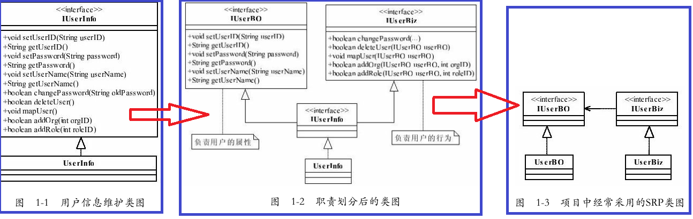

# 六大设计原则
## 一、单一职责原则（SRP）
### 1、一些名词
* `Single Responsibility Principle`，简称是**SRP**
* **RBAC模型**（Role-Based Access Control，基于角色的访问控制，通过分配和取消角色来完成用户权限的授予和取消，使动作主体（用户）与资源的行为（权限）分离。
* BO（Bussiness Object，业务对象）
* Biz（Business Logic，业务逻辑）

### 2、单一职责原则
* 单一职责原则的**定义**是：应该有且仅有一个原因引起类的变更。
* SRP的原话解释是：There should never be more than one reason for a class to change.（一个类改变的原因不应该不止一个。）
* 单一职责原则有什么好处：
  * 类的复杂性降低，实现什么职责都有清晰明确的定义；
  * 可读性提高，复杂性降低，那当然可读性提高了；
  * 可维护性提高，可读性提高，那当然更容易维护了；
  * 变更引起的风险降低，变更是必不可少的，如果接口的单一职责做得好，一个接口修改只对相应的实现类有影响，对其他的接口无影响，这对系统的扩展性、维护性都有非常大的帮助。
* **单一职责原则**提出了一个编写程序的标准，用“职责”或“变化原因”来衡量接口或类设计得是否优良，但是“职责”和“变化原因”都是不可度量的，因项目而异，因环境而异。

## 二、里氏替换原则

## 三、依赖倒置原则

## 四、接口隔离原则

## 五、迪米特法则

## 六、开闭原则