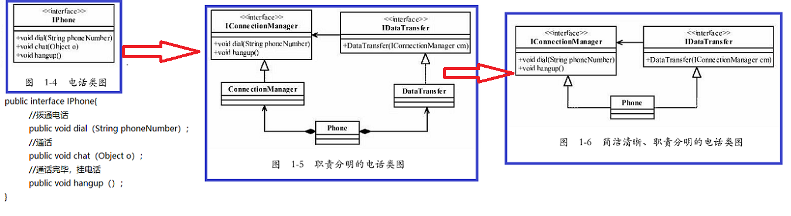

# 六大设计原则
## 一、单一职责原则（SRP）
### 1、一些名词
* `Single Responsibility Principle`，简称是**SRP**
* **RBAC模型**（Role-Based Access Control，基于角色的访问控制，通过分配和取消角色来完成用户权限的授予和取消，使动作主体（用户）与资源的行为（权限）分离。
* BO（Bussiness Object，业务对象）
* Biz（Business Logic，业务逻辑）

### 2、单一职责原则
* 单一职责原则的**定义**是：应该有且仅有一个原因引起类的变更。
* SRP的原话解释是：There should never be more than one reason for a class to change.（一个类改变的原因不应该不止一个。）

* 单一职责原则有什么好处：
  * 类的复杂性降低，实现什么职责都有清晰明确的定义；
  * 可读性提高，复杂性降低，那当然可读性提高了；
  * 可维护性提高，可读性提高，那当然更容易维护了；
  * 变更引起的风险降低，变更是必不可少的，如果接口的单一职责做得好，一个接口修改只对相应的实现类有影响，对其他的接口无影响，这对系统的扩展性、维护性都有非常大的帮助。
* **单一职责原则**提出了一个编写程序的标准，用“职责”或“变化原因”来衡量接口或类设计得是否优良，但是“职责”和“变化原因”都是不可度量的，因项目而异，因环境而异。

### 3、单一原则的实施与用途
- 单一原则的实施:
  - 对于接口，我们在设计的时候一定要做到单一，但是对于实现类就需要多方面考虑了。
  - 生搬硬套单一职责原则会引起类的剧增，给维护带来非常多的麻烦，而且过分细分类的职责也会人为地增加系统的复杂性。
  - 本来一个类可以实现的行为硬要拆成两个类，然后再使用聚合或组合的方式耦合在一起，人为制造了系统的复杂性。
  - 所以原则是死的，人是活的，这句话很有道理。
- 单一职责的用途
  - 适用于**接口**、**类**，同时也适用于**方法**。
  - 单一职责在**方法**中的应用：
    - **一个方法尽可能做一件事情**，比如一个方法修改用户密码，不要把这个方法放到“修改用户信息”方法中，这个方法的颗粒度很粗。
  - 类的单一职责：
    - "This is sometimes hard to see"，这句话翻译过来就是“这个有时候很难说”。
- 对于单一职责原则
  - 接口一定要做到单一职责；
  - 类的设计尽量做到只有一个原因引起变化。

## 二、里氏替换原则（LSP）
### 1、继承的优缺点
- 优点：
  - 代码共享，减少创建类的工作量，每个子类都拥有父类的方法和属性；
  - 提高代码的重用性；
  - 子类可以形似父类，但又异于父类，“龙生龙，凤生凤，老鼠生来会打洞”是说子拥有父的“种”，“世界上没有两片完全相同的叶子”是指明子与父的不同；
  - 提高代码的可扩展性，实现父类的方法就可以“为所欲为”了，君不见很多开源框架的扩展接口都是通过继承父类来完成的；
  - 提高产品或项目的开放性。
- 缺点：
  - 继承是侵入性的。只要继承，就必须拥有父类的所有属性和方法；
  - 降低代码的灵活性。子类必须拥有父类的属性和方法，让子类自由的世界中多了些约束；
  - 增强了耦合性。当父类的常量、变量和方法被修改时，必需要考虑子类的修改，而且在缺乏规范的环境下，这种修改可能带来非常糟糕的结果——大片的代码需要重构。

### 2、里氏替换原则

* 里氏替换原则（Liskov Substitution Principle,LSP）
* 定义：
  * 第一种定义，也是最正宗的定义：If for each object o1 of type S there is an object o2 of type T such that for all programs P defined in terms of T,the behavior of P is unchanged when o1 is substituted for o2 then S is a subtype of T.（如果对每一个类型为S的对象o1，都有类型为T的对象o2，使得以T定义的所有程序P在所有的对象o1都代换成o2时，程序P的行为没有发生变化，那么类型S是类型T的子类型。）
  * 第二种定义：Functions that use pointers or references to base classes must be able to use objects of derived classes without knowing it.（所有引用基类的地方必须能透明地使用其子类的对象。）
  * 第二个定义是最清晰明确的，通俗点讲，只要父类能出现的地方子类就可以出现，而且替换为子类也不会产生任何错误或异常，使用者可能根本就不需要知道是父类还是子类。但是，反过来就不行了，有子类出现的地方，父类未必就能适应。**（子类可以替换父类，父类不一定能替换子类）**
- **里氏替换原则**为良好的继承定义了一个规范，一句简单的定义包含了4层含义。 
  - 1.**子类必须完全实现父类的方法**（继承就是告诉你拥有父类的方法和属性，然后你就可以重写父类的方法。）
    - 注意：在类中调用其他类时务必要**使用父类或接口**，如果不能使用父类或接口，则说明类的设计已经违背了LSP原则。
    - 注意：如果子类不能完整地实现父类的方法，或者父类的某些方法在子类中已经发生“畸变”，则建议断开父子继承关系，采用依赖、聚集、组合等关系代替继承。
  - 2.**子类可以有自己的个性**（里氏替换原则可以正着用，但是不能反过来用。在子类出现的地方，父类未必就可以胜任。）
  - 3.覆盖或实现父类的方法时输入参数可以被放大
  - 4.覆写或实现父类的方法时输出结果可以被缩小

### 3、里氏替换原则实践

- 在项目中，采用里氏替换原则时，尽量避免子类的“个性”，一旦子类有“个性”，这个子类和父类之间的关系就很难调和了，
- 把子类当做父类使用，子类的“个性”被抹杀——委屈了点；
- 把子类单独作为一个业务来使用，则会让代码间的耦合关系变得扑朔迷离——缺乏类替换的标准。

## 三、依赖倒置原则

## 四、接口隔离原则

## 五、迪米特法则

## 六、开闭原则